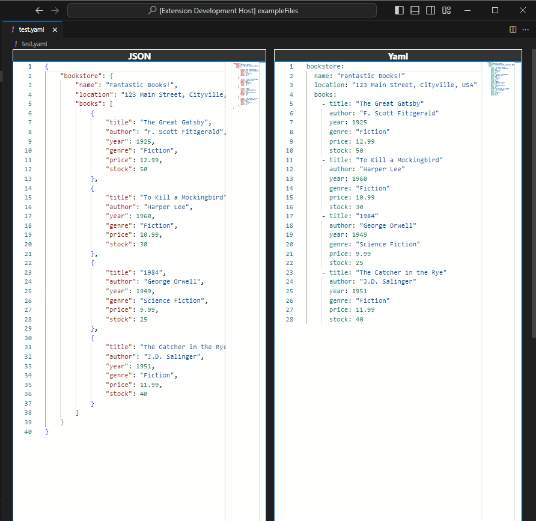

# YAML as JSON Custom Editor

I think that YAML is messy and unnecessarily hard to read once it is in anyway non trivial.
I'd prefer to work with a JSON file.
So this editor aims to let you transparently open YAML files as JSON, edit them as JSON, but whilst saving they will be converted back YAML and saved as such.

NOTE: This editor cannot work on all YAML.
YAML cryptically advertises itself as "superset of JSON".
This just means that you can convert any JSON to YAML, but there are a few 'extras' supported in YAML that cannot be converted to JSON.
So if you try to open a YAML file that cannot be converted to JSON then this cannot be used.

## Running the example

-   Open this example in VS Code 1.46+
-   `npm install`
-   `npm run watch` or `npm run compile`
-   `F5` to start debugging

Open the example files from the `exampleFiles` directory.
